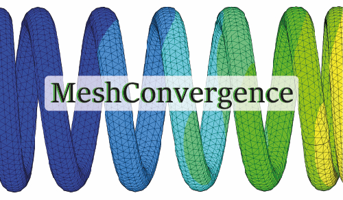

# MeshConvergence



## Descripción

**MeshConvergence** es una herramienta desarrollada en Python para facilitar el análisis de convergencia de malla en simulaciones por elementos finitos (FEA). 

## Funcionalidades v1.0

- Interfaz gráfica intuitiva
- Carga de resultados manualmente
- Gráfico elemento vs resultado

## Próximas actualizaciones

- Carga de resultados desde archivos `.csv`
- Buscar base de datos
- Borrar resultados de la base de datos


## Cómo ejecutar

El programa está empaquetado como un ejecutable `.exe`, por lo que **no se necesita tener Python instalado**. Solo descargá el archivo y ejecutalo.
Para colocar en el escritorio, crear acceso directo de la aplicación.

> Si estás usando el código fuente, necesitás tener Python y las siguientes librerías:
> 
> ```
> pip install matplotlib pandas
> ```

## Autor
Apasionado por la programación, la simulación y la mejora continua.

Desarrollado por [@matiasacc](https://github.com/matiasacc), estudiante de Ingeniería Mecánica. 

